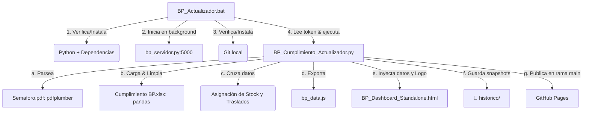

# Contexto del Proyecto: Dashboard de Cumplimiento de Órdenes

Este documento contiene un análisis técnico completo y detallado del **Dashboard de Control de Cumplimiento de Órdenes** de **Berries Paradise (BP)**. Sirve como referencia de contexto para que cualquier modelo de IA o desarrollador entienda la arquitectura de datos, el flujo de ejecución, la persistencia local y la estructura del frontend antes de realizar cambios o agregar nuevas funcionalidades.

---

## 1. Propósito y Objetivo de Negocio

El sistema tiene como objetivo principal evaluar el **cumplimiento de órdenes de venta (OVs)** frente al **inventario disponible** en tiempo real (o según la última actualización de datos). 
El dashboard permite:
- Cruzar pedidos (OVs) de la semana actual y siguiente con el inventario de **Producto Terminado (PT)** en diferentes cámaras frías (*coolers*).
- Identificar faltantes de stock y determinar la necesidad de **traslados de fruta** entre almacenes en función de cercanías logísticas.
- Monitorear el inventario de **Fruta a Granel** (en kilos) y pallets en proceso para prever la disponibilidad futura.
- Centralizar y persistir comentarios, embarques manuales y modificaciones de asignación directa (*overrides*) en archivos JSON locales.
- Publicar automáticamente los resultados actualizados a la web mediante **GitHub Pages**:
  [🔗 URL de Producción](https://hectorrenteriabp.github.io/CumplimientoPedidosBP/)

---

## 2. Mapa de Archivos y Componentes

La estructura de archivos en el espacio de trabajo se organiza de la siguiente manera:

```text
📁 Cumplimiento Ordenes/
│
├── ⚙️ BP_Actualizador.bat             # Script de entrada para Windows (orquesta todo el proceso)
├── 🐍 BP_Cumplimiento_Actualizador.py  # Procesador principal en Python (carga, cálculo y compilación)
├── 🐍 bp_servidor.py                  # API local para persistir comentarios y embarques manuales
├── 🔐 bp_token.txt                   # Archivo Git-Ignored con el Token Personal de GitHub
│
├── 📊 Cumplimiento BP.xlsx            # Libro Excel con OVs, Plan de Pedidos y catálogo de Coolers
├── 📊 Cumplimiento BP_PENDIENTE.xlsx  # Respaldo temporal si el Excel original estaba abierto
├── 📊 Labels.xlsx                     # Datos complementarios de etiquetas
├── 📄 Semaforo.pdf                   # Reporte de Inventarios PDF (PT + Granel) extraído de SAP
├── 🖼️ Logo BP.png                     # Logo corporativo integrado en el dashboard
│
├── 🌐 index.html                      # Redirección rápida al standalone con caché-busting
├── 🌐 BP_Dashboard_Cumplimiento.html  # Plantilla base del Dashboard (HTML + CSS + JS)
├── 🌐 BP_Dashboard_Standalone.html    # Versión de producción unificada (autocontenida, ~5MB)
│
├── 📁 historico/                      # Snapshots diarios en formato JSON para análisis históricos
│   ├── 📄 YYYY-MM-DD.json             # Historial de cumplimiento diario
│   └── 📄 granel_YYYY-MM-DD.json      # Historial de kilos a granel por almacén
│
└── 📁 backups_html/                   # Copias de seguridad de versiones anteriores de Standalone
```

---

## 3. Flujo de Ejecución (Pipeline de Datos)

El flujo completo se activa al ejecutar **`BP_Actualizador.bat`**:



### Detalle de las Etapas:
1. **Entorno**: El `.bat` se asegura de que existan `pandas`, `numpy`, `openpyxl` y `pdfplumber`. Si no existen, los instala silenciosamente.
2. **Servidor Local**: Arranca `bp_servidor.py` en el puerto `5000` si no se encuentra ya activo. Esto asegura que el frontend pueda guardar comentarios y embarques.
3. **Procesamiento de Datos**: Se invoca a `BP_Cumplimiento_Actualizador.py`, el cual realiza las siguientes tareas de fondo:
   - **Lectura del Inventario SAP (`Semaforo.pdf`)**: Extrae y clasifica los pallets de Producto Terminado (PT) y Producto a Granel (Kilos) mediante expresiones regulares y lógica por zona/almacén.
   - **Procesamiento de Pedidos (`Cumplimiento BP.xlsx`)**: Carga las hojas de órdenes de venta, limpia campos de texto, normaliza claves de OV y resuelve la ambigüedad de fechas procedentes de SAP (detectando si el formato es MM/DD/YYYY o DD/MM/YYYY y forzándolos dentro de la ventana de negocio activa: mes actual + siguiente).
   - **Cálculo de Coberturas**: Determina si cada partida de orden tiene stock suficiente en su almacén de origen (Cooler asignado). Si no, busca en coolers alternativos ordenados por prioridad de cercanía (Cercano 1, Cercano 2, Indirecto) y propone **traslados lógicos**.
   - **Escritura del JS (`bp_data.js`)**: Serializa los resultados en el objeto global `D`.
   - **Generación de Standalone**: Lee la plantilla `BP_Dashboard_Cumplimiento.html`, inyecta el contenido de `bp_data.js` reemplazando los marcadores `/* SE_DATA_START */` y `/* SE_DATA_END */`, codifica `Logo BP.png` en base64 para que el archivo sea 100% independiente y escribe `BP_Dashboard_Standalone.html`. Mantiene un historial de los últimos 10 archivos generados en `backups_html/`.
   - **Históricos**: Registra un resumen diario en `historico/` para graficar tendencias en el futuro.
4. **Despliegue GitHub Pages**:
   - Inicializa el repositorio local en Git si no existe.
   - Genera un archivo `.gitignore` para no subir archivos Excel pesados ni tokens.
   - Actualiza `index.html` insertando un parámetro de *cache-busting* dinámico (`?v=timestamp`) que evita que el navegador mantenga en caché versiones viejas del dashboard.
   - Hace commit de `BP_Dashboard_Standalone.html` e `index.html` y ejecuta un `push --force` a la rama `main` del repositorio remoto `hectorrenteriabp/CumplimientoPedidosBP` usando el token obtenido.

---

## 4. Persistencia Local (`bp_servidor.py`)

Para permitir la edición interactiva en el frontend sin necesidad de una base de datos pesada, el proyecto utiliza un microservicio HTTP local basado en `http.server`:

- **Puerto**: `5000` (con cabeceras CORS habilitadas para cualquier origen `*`).
- **Endpoints**:
  - `GET /ping`: Verifica el estado de salud del servidor.
  - `GET /datos/<archivo>.json`: Carga un archivo JSON de configuración.
  - `POST /datos/<archivo>.json`: Escribe datos enviados por el frontend (valida que el cuerpo sea un JSON válido antes de guardar).
- **Seguridad**: Solo permite escribir y leer archivos incluidos en la whitelist:
  1. `bp_comentarios.json`: Comentarios realizados por los analistas sobre las OVs.
  2. `bp_embarques_manual.json`: Registros logísticos editados directamente desde la interfaz.

---

## 5. Estructura y Vistas del Dashboard (Frontend)

El frontend está estructurado en torno a una barra de navegación con diez (10) pestañas de control premium altamente responsivas:

1. **📊 Resumen**: Tarjetas de indicadores clave de rendimiento (KPIs), gráficas de avance, porcentaje general de cumplimiento del día y conteo de órdenes completas/parciales.
2. **📋 Plan del Día**: Detalle por línea de pedido para la fecha seleccionada. Muestra alertas de faltantes, estatus del Cooler origen e inventario local.
3. **📦 Inventario**: Vista detallada del producto terminado en los coolers activos.
4. **🚚 Traslados**: Propuesta automática de movimientos logísticos optimizados entre almacenes para cubrir faltantes del plan del día.
5. **🫐 Fruta Disponible**: Inventario detallado desglosado por tipo de fruta (Blueberry, Blackberry, Raspberry, Strawberry).
6. **🏭 Fruta a Granel**: Detalle de kilos en almacenes para fruta a granel y pallets en proceso de acondicionamiento.
7. **🚛 Embarques**: Control de despachos, consolidación de transportes y asignación de prioridad de carga.
8. **✅ Cumplimiento**: Análisis cuantitativo de cumplimiento agrupado por cliente, destino y variedad.
9. **🚦 Sem. Embarques**: Semáforo visual del estatus de preparación de las cargas logísticas pendientes.
10. **📈 Histórico**: Tableros dinámicos y gráficas de tendencia cargados desde los archivos históricos guardados en la carpeta `historico/`.

---

## 6. Guía para Realizar Cambios de Forma Segura

Cuando vayas a realizar modificaciones en este repositorio, ten en cuenta los siguientes puntos críticos:

### A. Si vas a modificar `BP_Cumplimiento_Actualizador.py` (Procesador Python):
- **Lectura del Semáforo**: Si el formato de SAP en `Semaforo.pdf` cambia (por ejemplo, nuevas columnas, cabeceras de coolers o tipos de empaques), debes actualizar las expresiones regulares en las funciones `parse_semaforo()` (línea 97) y `parse_granel()` (línea 212).
- **Asignación de Coolers**: La función `derivar_cooler()` (línea 1340) gestiona cómo se resuelven las cámaras frías correspondientes según la OV y cliente. Modifícala si la lógica de prioridad o cercanía logística cambia.
- **Evitar Errores de Guardado**: Mantén siempre activa la función `_safe_save()`. Esta previene bloqueos de ejecución si el usuario tiene `Cumplimiento BP.xlsx` abierto en Excel al momento de correr el actualizador, desviando los datos a `Cumplimiento BP_PENDIENTE.xlsx`.
- **Identidad en Git**: La publicación automática configura temporalmente un email local (`actualizador@berries.com.mx`). Asegúrate de no romper este bloque de configuración en `auto_publicar_github()` para evitar bloqueos por permisos en plataformas Windows.

### B. Si vas a modificar la Interfaz Gráfica (`BP_Dashboard_Cumplimiento.html`):
- **Carga de Datos**: El dashboardStandalone inyecta los datos de `bp_data.js` en tiempo de compilación. No alteres los comentarios delimitadores `/* SE_DATA_START */` ni `/* SE_DATA_END */` en la sección de scripts del HTML.
- **Llamadas a la API Local**: Si añades configuraciones interactivas editables por el usuario en caliente (p. ej., filtros guardados o configuraciones de capacidades de transporte), recuerda agregar el archivo JSON correspondiente a la whitelist `ARCHIVOS_PERMITIDOS` en `bp_servidor.py` para poder usar los endpoints GET y POST en el puerto `5000`.

### C. Guardar Credenciales:
- El token de acceso a GitHub se mantiene seguro en `bp_token.txt`. Nunca lo expongas en el código de Python ni en el `.bat` y verifica que permanezca listado en el `.gitignore`.

---
*Contexto analizado y documentado exitosamente en mayo de 2026.*
